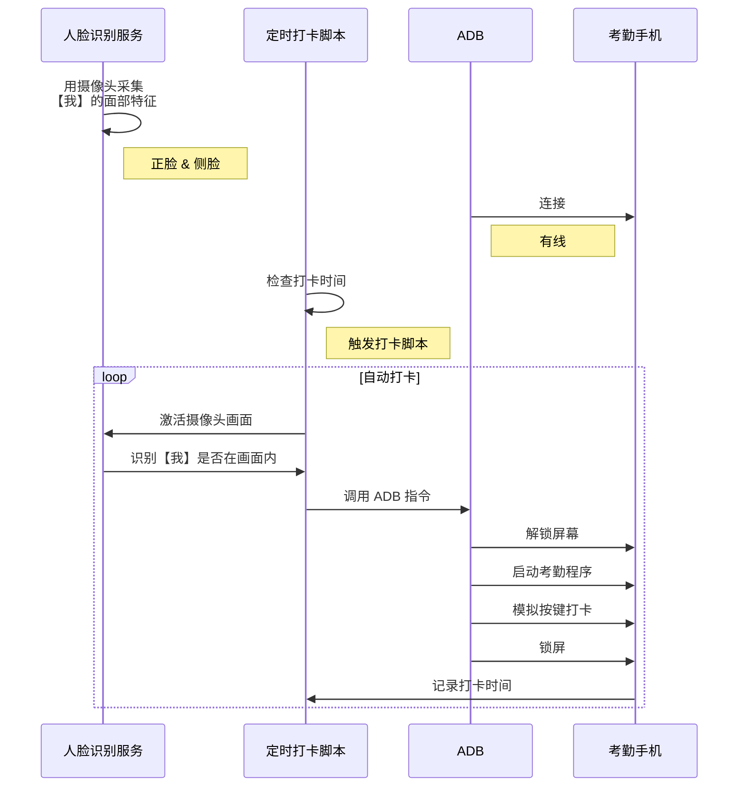

# AI-auto-checkin

> AI 自动考勤

------

## 运行环境

  

## 项目说明

相信很多人都有上下班忘记考勤签到的问题，此项目就是为了解决这个问题。

只要在 PC 运行此程序，即可通过 PC 摄像头进行人脸识别；只要判定是本人，就能够触发手机上的考勤程序进行自动打卡。

> 只要能安装在 Android 的考勤程序都能使用

## 程序原理

## 硬件接线

硬件要求：

- PC 摄像头： 用于 AI 人脸识别，作为触发解锁手机考勤的安全条件
- 支持数据传输的可充电式手机支架： 用于接收 ADB 指令

> 如果你的考勤程序不需要进一步做人脸识别（如钉钉等），可以把手机支架换成数据线

## 实机演示

TODO

## 