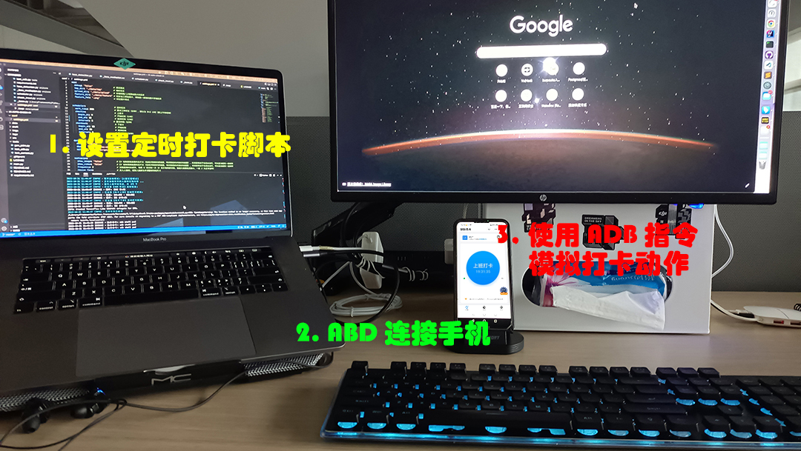

# AI-Auto-Checkin

> AI 自动考勤

------

## 0x00 运行环境

  

## 0x10 项目说明

相信很多人都有上下班忘记考勤签到的问题，此项目结合 [Mediapipe](https://mediapipe.dev/) 可以有效解决这个问题：

- 只要在 PC 运行此程序，即可通过 PC 摄像头进行 AI 人脸识别
- 若 AI 判定是本人，就能够用 ADB 触发手机上的考勤 APP 进行自动打卡。

> 使用 ADB 能确保支持大部分 Android 的考勤程序

## 0x20 程序原理

> 理论上不需要人脸识别也能使用，但安全性会大大降低，毕竟万一不在工位时、手机又被 ADB 解锁 ...

## 0x30 硬件接线

| 硬件 | 要求 | 用途 |
|:---:|:---|:---|
| PC 摄像头 | 内置/外设均可 | 用于 AI 人脸识别，作为触发解锁手机考勤的安全条件 |
| 手机支架 | 可充电、支持数据传输 | 用于接收 ADB 指令 |

> 如果你的考勤 APP **不需要**进一步做人脸识别（如钉钉等），可以把手机支架换成数据线

## 0x40 实机演示

## 0x50 使用步骤

### 0x51 预操作：安装依赖

1. 安装 [Python 3.8](https://www.python.org/downloads/release/python-385/)
2. 执行命令 `python -m pip install -r requirements.txt`

> 若 [dlib](http://dlib.net/) 安装失败，可能需要重新安装 [CMake](https://cmake.org/)

### 0x52 预操作：安装 ADB

Google 提供了无需安装 Android Studio SDK 的 ADB 版本：

- Windows:  【[Google 下载](https://dl.google.com/android/repository/platform-tools-latest-windows.zip)】【[Github 下载](./adb/platform-tools_r33.0.3-windows.zip)】
- Mac:  【[Google 下载](https://dl.google.com/android/repository/platform-tools-latest-darwin.zip)】【[Github 下载](./adb/platform-tools_r33.0.3-darwin.zip)】
- Linux:  【[Google 下载](https://dl.google.com/android/repository/platform-tools-latest-linux.zip)】【[Github 下载](./adb/platform-tools_r33.0.3-linux.zip)】

下载并解压后，配置 ADB 环境变量、即可连接到手机，详细可参考《[ADB 连接手机教程](TODO)》。

> 如果已经安装了 [ADB](https://developer.android.com/studio/command-line/adb?hl=zh-cn) 环境则无需重新安装了，测试命令: `adb --version`

### 0x53 预操作：设置标准脸 

标准脸，即用于人脸识别过程中、对齐五官坐标的脸，是类似参考系一般的存在。

因为摄像头在拍摄的时候，我们的脸不可能每次都刚好完全在同一个 **角度/位置/距离**，如果不对齐两张脸直接进行比对，就会导致即使是同一人都没法识别出来。

这时就需要一张标准脸，把我们拍摄的所有人脸，都 **旋转/平移/缩放** 到和标准脸一样的 **角度/位置/距离**，就能在确保一定误差范围内识别人脸。

此项目对设置标准脸的方法做了一定的封装，具体设置的方法如下：

1. 网上任意找一张人脸，最好相对规正的正脸，如 [吴彦祖-正脸.png](./face/00_standard/吴彦祖-正脸.png)
2. 用 PhotoShop 将其裁剪加工，做成五官在画面正中的 `N x M` 的头像（N、M 可以为任意值，建议 `N = M`，如 `512 x 512`）
3. 修改 [settings.xml](./conf/settings.yml) 中的 `mediapipe.standard_face` 值为 `N x M`
4. 执行命令 `python ./presrc/gen_standard.py`
5. 根据提示选择第 2 步加工后的头像照片
6. 如无异常，即成功生成标准脸数据到 [`data/standard`](./data/standard/) 目录下，如 [`512 x 512`](./data/standard//512x512)
7. 标准脸只需要设置一次即可，当设置有多个时，以 [settings.xml](./conf/settings.yml) 的 `mediapipe.standard_face` 设置值为准

> 此项目已预生成了一张**标准正脸**数据，如果使用场景需要**标准侧脸**，建议重新设置

### 0x54 预操作：建库

1. 执行命令 `python ./presrc/gen_pdm.py`
2. 如无异常即创建 sqlite3 成功

> 数据库只需要创建一次，主要用于存储【你】的特征脸

### 0x55 预操作：录入【你】的特征脸

特征脸，即之后用于比对是不是【你】本人的脸。

具体录入的方法如下：

1. 【二选一】执行命令 `python ./presrc/gen_feature.py -c` 打开摄像头按 `s` 拍摄个人照片
2. 【二选一】执行命令 `python ./presrc/gen_feature.py` 上传个人照片
3. 如无异常，即录入特征成功

> 可以从各个角度录入多次，特征脸越多，匹配成功的概率越大

### 0x56 预操作：手机配置

1. 配置 [settings.xml](./conf/settings.yml) 中的 `adb.app` ，指定为一个考勤 app 名字（可自定义），如 `DingDing`
2. 参考 [settings.xml](./conf/settings.yml) 中 `DingDing` 的配置，主要修改 `open_app` 和 `check_in` 的命令列表即可
3. 需要配置的有两种命令：
    - `input tap <x> <y>`: 模拟手动点击屏幕坐标，坐标值可以截屏后查看
    - `wait <second>`: 点击后等待多少秒生效
4. 用这两种命令模拟手动打卡的全过程即可:

<b>查看手机坐标方法</b>

 

坐标值可以截屏后查看：

- 方法一 PS : 菜单 `->` 窗口 `->` 信息 `->` `十` `->` 像素，鼠标悬浮在图片上后即可查看坐标
- 方法二画图: 鼠标悬浮在图片上后，直接在左下角即可查看

### 0x57 正式使用

完成前面所有准备工作后，即可正式使用此软件：

1. PC 通过 adb 连接手机
2. 确保 PC 摄像头对准【你】的脸
3. 确保手机摄像头对准【你】的脸（如果考勤 APP 不需要人脸考勤则不必）
4. 配置 [settings.xml](./conf/settings.yml) 中的 `scheduler`，根据实际考勤时间和时长配置
5. 执行命令 `python .\main.py -c -p {unlock_password}` 让程序一直待机运行即可，其中 `{unlock_password}` 为手机解锁密码

> 上班卡和下班卡的时间范围不能存在交错，否则定时任务会同时启动两个线程，导致摄像头无法打开（摄像头同一时间只允许被一个线程占用）

### 0x58 辅助命令

- 清除拍摄图片缓存: `python ./presrc/clean_images.py`
- 获取摄像头参数: `python ./presrc/get_camera_size.py`

## 0x60 开发者文档

- 《[开发者指引](./DevSOP.md)》
- 《[单元测试](./tests/)》
