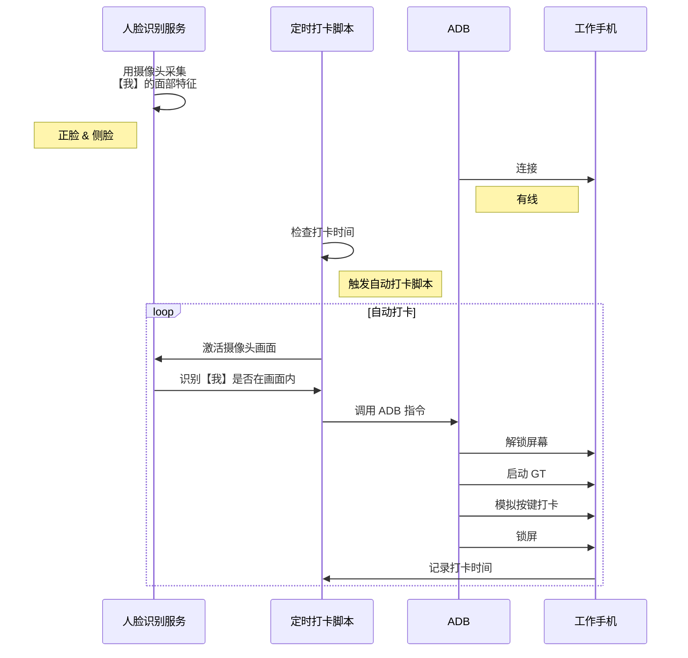

adb：连接华为手机 https://cto.eguidedog.net/node/609
adb 无线： https://blog.csdn.net/ai_qh77/article/details/123383801
adb： error: device unauthorized. https://stackoverflow.com/questions/23081263/adb-android-device-unauthorized
adb 指令： https://www.cnblogs.com/botoo/p/9655798.html?share_token=bc2d44e1-e6d5-40fd-9890-7c6b8eebc8ed
 
*#*#2846579#*#*


```shell
# 进入 shell (可以不进入)
adb shell

# 唤醒屏幕
adb shell input keyevent 224

# 滑动调出密码输入
adb shell input swipe 300 1000 300 500

# 输入锁屏密码
adb shell input text <password>

# 返回首页
adb shell input keyevent 3

# 查找 GT 包名
adb shell dumpsys window w | grep "geniustalk"
# com.dji.geniustalk/com.dji.geniustalk.ui.main.HomeActivity

# 调起 GT (不支持， GT 设置了 android:exported="false" 禁止外部调用)
adb shell am start com.dji.geniustalk/com.dji.geniustalk.ui.main.HomeActivity

# 微信是可以的
adb shell am start com.tencent.mm/com.tencent.mm.ui.LauncherUI

# 点击屏幕坐标逐步打开 (座标可以截屏再通过画图工具查看)
# 点开分类
adb shell input tap 411 1387

# 点开 GT
adb shell input tap 800 706

# 选择应用
adb shell input tap 543 2051

# 点击打卡
adb shell input tap 896 849
```


