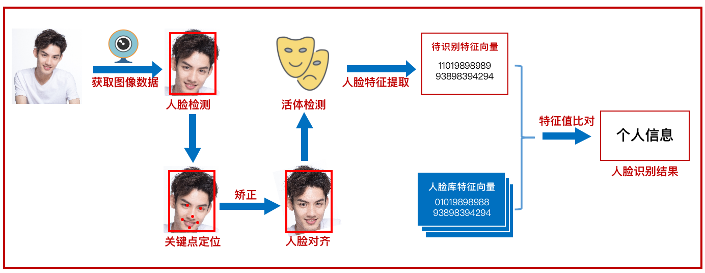

# 开发者资料

------

## 0x00 关键流程

上图已经完整地描述了人脸识别整个过程需要用到的技术点：

| 关键流程 | 实现方法 | 依赖技术 |
|:---|:---|:---|
| 人脸采集 (Face Collect) | 任意摄像头或照片均可，提前录入标准人脸，用于后续比对 | [opencv](https://opencv.org/) |
| 人脸检测 (Face Detection) | 涵盖了关键点检测，推荐用开源工具实现 | [mediapipe](https://google.github.io/mediapipe/) |
| 特征定位 (Feature Landmarks) | 通常合并到人脸检测一起得到各个特征的地标 | - |
| 人脸对齐 (Face Alignment) | 通过仿射矩阵对人脸进行旋转/平移/缩放处理，使得人脸的角度/位置/距离尽可能贴近标准脸 | [numpy](https://numpy.org/) |
| 活体检测 (Living Detection) | 这里不涉及 | - |
| 特征提取 (Face Feature) | 把人脸各个特征点归一化、输入神经网络进行 Embedding，得到一个 n 维的特征向量 | [dlib](https://github.com/davisking/dlib) |
| 特征比对 (Face Compare) | 计算两个特征向量的欧氏距离，得到人脸的相似度 | [numpy](https://numpy.org/) |

## 0xF0 参考资料

### 0xF1 入门大纲

- 《[mediapipe 官方文档](https://google.github.io/mediapipe/solutions/solutions.html)》
- 《[5 种最著名的人脸识别算法和关键特征介绍](https://blog.csdn.net/tsingsee/article/details/121514932?share_token=8012fabd-4bcb-4d28-abff-823a195e8eaf)》
- 《[人脸识别简介](https://www.jianshu.com/p/6ed3e26b4ebc?utm_campaign=maleskine&utm_content=note&utm_medium=seo_notes&utm_source=recommendation)》

### 0xF2 人脸检测

- 《[MediaPipe 基础 - 人脸检测](https://blog.csdn.net/weixin_43229348/article/details/120524852)》
- 《[Mediapipe 人脸网格 (Face Mesh)](https://steam.oxxostudio.tw/category/python/ai/ai-mediapipe-face-mesh.html)》
- 《[利用机器学习进行人脸 468 点的 3D 坐标检测](https://www.toutiao.com/article/6913754944206258696/?app=news_article&timestamp=1666621808&use_new_style=1&req_id=202210242230080102121621361C58653B&group_id=6913754944206258696&wxshare_count=1&tt_from=weixin&utm_source=weixin&utm_medium=toutiao_android&utm_campaign=client_share&share_token=2903d457-7d99-47f1-bce3-1787abde8660&source=m_redirect&wid=1666629121540)》
- 《[基于 mediapipe 的人体 33 个关键点坐标（BlazePose）](https://blog.csdn.net/qq_64605223/article/details/125606507)》
- 《[人脸三维关键点检测 + 颜值打分（达芬奇指标）](https://www.bilibili.com/video/BV1ei4y1d7zA/?is_story_h5=false&p=4&share_from=ugc&share_medium=android&share_plat=android&share_session_id=0b5ebe12-cde7-48e8-a079-fd406805866a&share_source=WEIXIN&share_tag=s_i&timestamp=1666659516&unique_k=NommQi6)》
- 《[opencv-mediapipe 人脸检测-颜值打分 + 摄像头实时](https://blog.csdn.net/weixin_52465909/article/details/122183670)》

### 0xF3 人脸对齐

- 《[如何通俗地讲解「仿射变换」这个概念](https://www.zhihu.com/question/20666664)》
- 《[人脸对齐（视频）](https://www.bilibili.com/video/BV1J94y1D7f2/?is_story_h5=false&p=1&share_from=ugc&share_medium=android&share_plat=android&share_session_id=21a0f014-ad8d-419f-b92f-852823a4d623&5%E7%A7%8D%E6%9C%80%E8%91%97%E5%90%8D%E7%9A%84%E4%BA%BA%E8%84%B8%E8%AF%86%E5%88%AB%E7%AE%97%E6%B3%95%E5%92%8C%E5%85%B3%E9%94%AE%E7%89%B9%E5%BE%81%E4%BB%8B%E7%BB%8D%20share_source=WEIXIN&share_tag=s_i&timestamp=1667087907&unique_k=d1j29L6)》

### 0xF4 特征提取

- 《[如何理解归一化（normalization）](https://zhuanlan.zhihu.com/p/424518359)》
- 《[Embedding 的理解](https://zhuanlan.zhihu.com/p/46016518)》
- 《[python dlib 学习：比对人脸](https://blog.csdn.net/hongbin_xu/article/details/78390982)》
- 《[提取人脸特征的三种方法](https://bbs.huaweicloud.com/blogs/368207)》
- 《[使用 dlib 进行人脸识别](https://juejin.cn/post/7065888066379972638)》

### 0xF5 特征比对

- 《[人脸识别相似度计算方法](https://blog.csdn.net/u012505617/article/details/89191158)》
- 《[欧氏距离、标准化欧氏距离、马氏距离、余弦距离](https://blog.csdn.net/Kevin_cc98/article/details/73742037)》
- 《[欧氏距离和余弦相似度（以图搜图场景）](https://cloud.tencent.com/developer/article/1487432)》
- 《[数据归一化和相似性](https://blog.csdn.net/xsdxs/article/details/49857591)》
- 《[L2 归一化后欧拉距离的平方和 cosine 相似度等价](https://zhuanlan.zhihu.com/p/158199835?utm_id=0)》
- 《[一文搞懂深度学习正则化的 L2 范数](https://blog.csdn.net/u010725283/article/details/79212762)》
- 《[人脸特征相似度计算](https://blog.csdn.net/u014657795/article/details/85850891?share_token=e5d5a8d7-ebd4-4c43-9285-f9afbff9aade)》
- 《[用 Python 实现一个简单的——人脸相似度对比](https://cloud.tencent.com/developer/article/1775752)》

### 0xFF 其他

- Mediapipe 演示视频：《[Live Perception for Mobile and Web (ECCV 16th Embedded Vision Workshop)](https://www.youtube.com/watch?v=V9CiJhHQKkc)》
- 《[Mac 安装 dlib 记录](https://blog.csdn.net/Robin_Pi/article/details/119909829)》
- 《[使用 opencv 在视频上添加文字和标记框](https://blog.csdn.net/weixin_30852419/article/details/97603572)》

