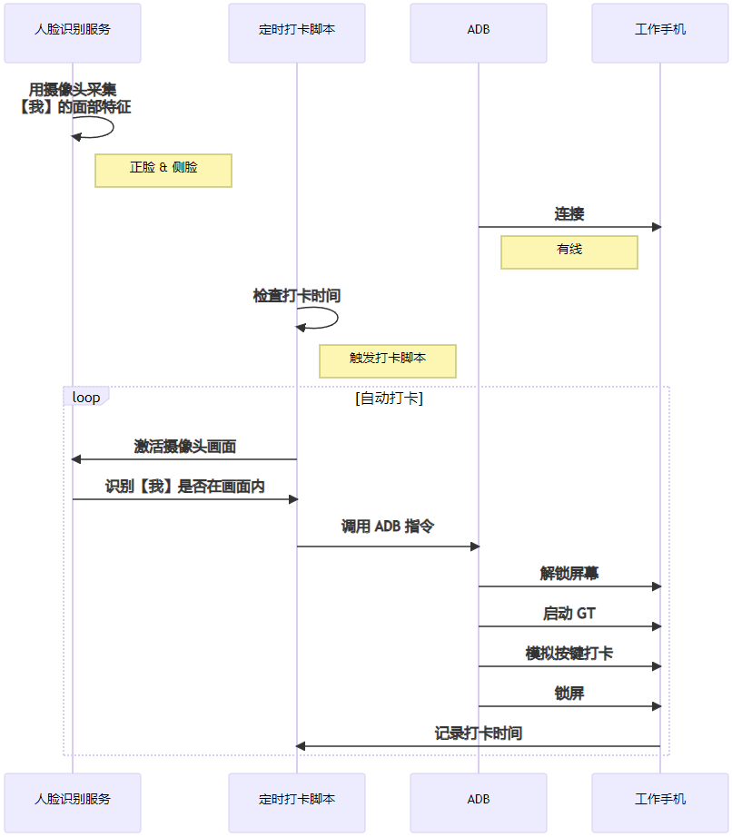
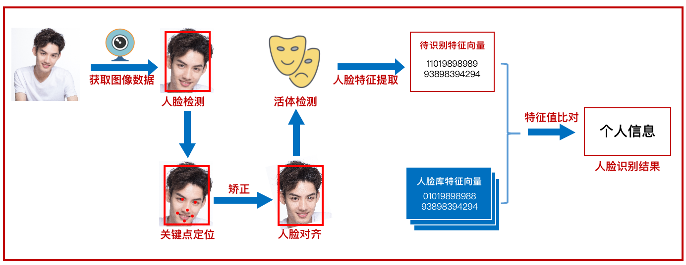
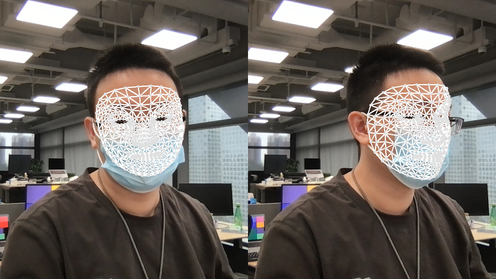
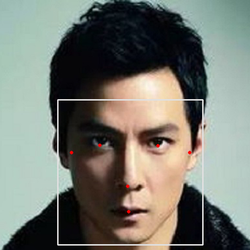

## 0x00 前言

自从搬来天空之城后，因为打卡习惯改变了，导致我上下班时常常忘记打卡。

于是我就有了一个构想：能不能在工位做一个打卡机，到点就帮我自动打卡呢？


## 0x10 约束

首先做这个事情得先确保合规性，一些约束条件还是必须遵守的。

公司目前允许打卡的方式有 2 个：

1. 各楼层门禁
2. 手机 GT （只能在公司范围内）

很自然的就想到只能用手机 GT 来做了，而且因为是在工位打卡，应该是没有问题的。

另外早两年做过手机 GT 的渗透，知道 GT 本身也有一些限制条件：

1. 禁止在 ROOT 手机上启动
2. 禁止在模拟器启动
3. 禁止第三方 APP 拉起 GT 服务
4. 必须是本人在摄像头前面才能打卡

所以现在的问题在于，**怎么在所有约束条件下，实现自动化打卡呢？**


## 0x20 思路 

### 0x21 版本一

最简单粗暴直接的方法，就是用一个支架把手机立起来，并且打开 GT 签到的界面，然后写一个后台程序定时模拟点击打卡按钮。

但是这个方法不可取，因为 APP 默认是无权限解锁手机屏幕的（起码非 ROOT 环境不行），换言之这个方案成立的必要条件是手机一直亮屏，**从安全性考虑就已经不会采纳**了。


### 0x22 版本二

由于我的工作手机是 Android 的，所以我在呼吸时就想到借助 [ADB (Android Debug Bridge)](https://developer.android.com/studio/command-line/adb) 工具了。

因此思路转变为：

1. PC 通过 ADB 连接手机
2. PC 设置【上/下班打卡】两个定时任务脚本，脚本触发时：
    - 通过 ADB 指令解除手机的锁屏状态
    - 通过 ADB 指令模拟人工操作，启动 GT 并打卡
    - 通过 ADB 指令通知手机锁屏

硬件接线参考下图：

> 由于需要 ADB 通讯和长时间待机，因此手机支架我采购了可充电式的


但是这个方法纯粹只是通过定时任务触发的，若触发时我不在工位上，手机被解锁，依然会有安全风险。

所以这里还欠缺一个关键条件：**必须是【我】在工位上才能解锁手机！**


### 0x23 最终方案

由于我不久前才做过一期视觉 AI，于是我又很自然地在喝水时想到了：**利用 PC 的摄像头做人脸识别**不就可以了吗？

所以最终整个方案的设计变成这样：



> 由于只需要识别【我】一个人，所以人脸识别服务完全可以部署在 PC 本地


## 0x30 关键实现

基于前面的方案设计和技术原理，必要的准备工作是：提前计算【我】本人的面部特征值、并写入特征库，需要识别时再取出来比对。

那具体应该怎么做呢？



网上扒的这个图已经完整地描述了人脸识别整个过程需要用到的技术点。

下面会跟着这些步骤解释一下我实现的过程，细节地方不做深入展开，后面有时间再做一个专题和大家探讨一下。

> 这里不涉及活体检测


### 0x31 人脸检测（Face Detection）

人脸检测涵盖了关键点检测（关键点坐标一般称为地标），这里推荐用开源工具实现，如 MediaPipe、OpenPose、MMPose、dlib 等等都可以。

我用摄像头自拍的时候，把我的【正脸】和【侧脸】都一起拍进去检测了。

这是因为我的 PC 摄像头是斜对着我的，我写的这个 AI 又比较低智，没学过怎么从侧脸推理出正脸，对 AI 而言正脸和侧脸就是两个不同的人。

所以为了提高成功率，需要把两种角度的人脸都采样分析。


以正脸为例，这里可以得到我面部 6 个关键点的地标分别为：

```
[
    [642.6734161376953, 307.81837463378906],    # 右眼
    [730.0695037841797, 299.2723846435547],     # 左眼
    [698.189697265625, 358.39449405670166],     # 鼻尖
    [697.9909515380859, 398.7664604187012],     # 口中
    [583.0513000488281, 324.0900707244873],     # 右耳
    [772.1451568603516, 306.3517427444458]      # 左耳
]
```

但如果想更准确的话，例如希望戴着口罩也能准确识别到身份，那么在检测时可以尽可能地提取更多的关键点。

目前我使用 Google 的模型，一个人脸网格最多可以识别出 468 个关键点，包括眼睫毛、眼眶、瞳孔等等。

但是因为我在工位的时候很少戴口罩，所以最终只取了五官的地标。




### 0x32 人脸对齐（Face Alignment）

但是关键点的地标不能直接用于特征计算，因为人脸不可能每次都刚好完全在同一个角度、位置、距离对着摄像头，甚至不同型号的摄像头的因为分辨率不一样，也会造成同一个人每次检测到的关键点地标不一样。

为了解决这个问题，我们需要对关键点的地标做预处理。

简单来说，找一个标准脸（标准尺寸、五官位置标准的人脸图像），计算其关键点地标；之后采集的每一张人脸都以标准脸作为参考系，把关键点一一映射到标准脸上。

这个过程其实就是人脸对齐，**目的是把人脸尽可能映射到同一参考系中，提高后续计算的精度**。

例如，以分辨率 `512 x 512` 的吴彦祖头像作为标准脸，那么先找到吴彦祖脸部关键点的地标：



```
[
    [204, 297],     # 右眼
    [324, 297],     # 左眼
    [260, 381],     # 鼻尖
    [260, 433],     # 口中
    [145, 312],     # 右耳
    [389, 312]      # 左耳
]
```

然后我希望长得和吴彦祖一样，就把自己的五官摆到吴彦祖五官对应的位置。

当然附近的位置同时要做平移、旋转、缩放，这个过程在数学上称为矩阵的[仿射变换](https://www.zhihu.com/question/20666664)。

变换后我的脸就变成这样：


### 0x33 特征提取（Face Feature）

人脸对齐之后，把地标做[归一化](https://zhuanlan.zhihu.com/p/424518359)处理（即映射坐标值范围到 `[0, 1]` 之间），然后输入神经网络进行 [Embedding](https://zhuanlan.zhihu.com/p/46016518)（把离散变量转为连续向量）处理，就可以得到一个 n 维的特征值，这个特征值就可以代表一张脸。

例如我的正脸特征值是：`[ 0.20714756965086467 ... 0.589757012077309 ]`。

> 特征值的计算方法目前一般是闭源的，常见的特征值一般是 `1 x 128` 的矩阵


### 0x34 人脸匹配（Face Compare）


有了特征值，往后的事情就比较简单了：

- 每当到达打卡时间点时，激活 PC 摄像头、并采集最接近画面的人脸
- 如果该人脸的特征值，与特征库中【我】的特征值相似度较高，则用 ADB 解锁手机 GT 打卡
- 否则取消该轮打卡动作

而判断两张脸是否为同一人，常用的算法是通过 [欧氏距离/余弦距离](https://cloud.tencent.com/developer/article/1487432) 计算特征值的相似度：相似度越高，则为同一人的置信度就越高。


### 0x35 ADB

[ADB (Android Debug Bridge)](https://developer.android.com/studio/command-line/adb) 是 Android 调试的常用工具之一。

在这里主要是用 ADB 模拟手动操作，**所以不需要 ROOT 手机**。

要实现模拟 GT 打卡，只需要组合 6 个 ADB 命令：

- 唤醒屏幕: `adb shell input keyevent 224`
- 滑动屏幕: `adb shell input swipe <x1> <y1> <x2> <y2>`
- 输入锁屏密码: `adb shell input text <password>`
- 返回首页: `adb shell input keyevent 3`
- 点击屏幕某个坐标: `adb shell input tap <x> <y>`
- 锁屏: `adb shell input keyevent 223`

根据实际手机的屏幕分辨率修改命令坐标，即可实现在任意 Android 中模拟手动在 GT 打卡的流程。

> 坐标可以在手机截屏后、传到 PC 查看


## 0x40 成品展示

### 0x41 演示-录入人脸特征  

![[演示-录入人脸特征.mp4]](74d30a4d764a4b7eab1e179002528d5f)


### 0x42 演示-全自动打卡 

![[演示-全自动打卡.mp4]](9308e3c4e18046679ccb87fb5e363737)


## 0x50 后记

我现在只要把手机放在支架上充电，就能全自动打卡机保证我今天至少打满了 8 小时的卡。

后来为了避免 AI 频繁打开摄像头确认我的身份，我还添加了一些前置约束条件进行优化：

- 手机不在支架上时不触发
- 电脑锁屏时不触发
- 打了上班卡之后，未满 8 小时不触发下班卡
- 已打满 8 小时考勤时不触发


## 0x60 参考文档

- 《[MediaPipe Face Detection](https://google.github.io/mediapipe/solutions/face_detection.html)》
- 《[仿射变换](https://www.zhihu.com/question/20666664)》
- 《[归一化](https://zhuanlan.zhihu.com/p/424518359)》
- 《[Embedding](https://zhuanlan.zhihu.com/p/46016518)》
- 《[欧氏距离和余弦相似度](https://cloud.tencent.com/developer/article/1487432)》
- 《[正则化的 L2 范数](https://blog.csdn.net/u010725283/article/details/79212762)》
- 《[ADB (Android Debug Bridge)](https://developer.android.com/studio/command-line/adb)》
