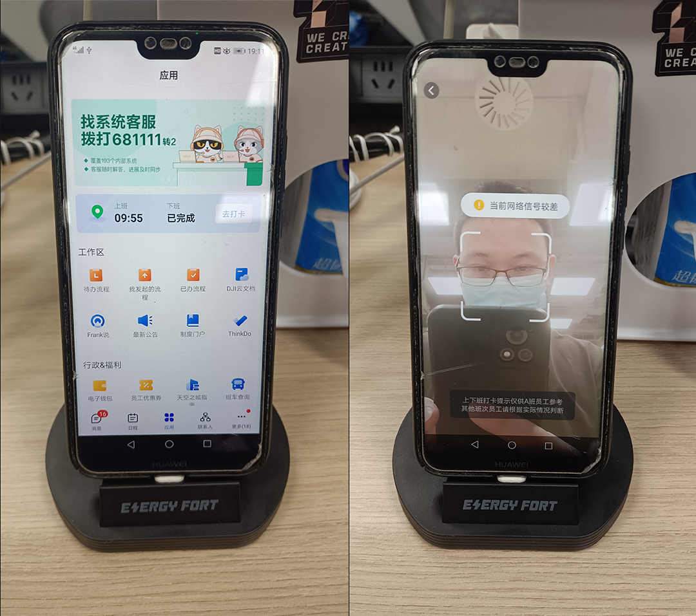
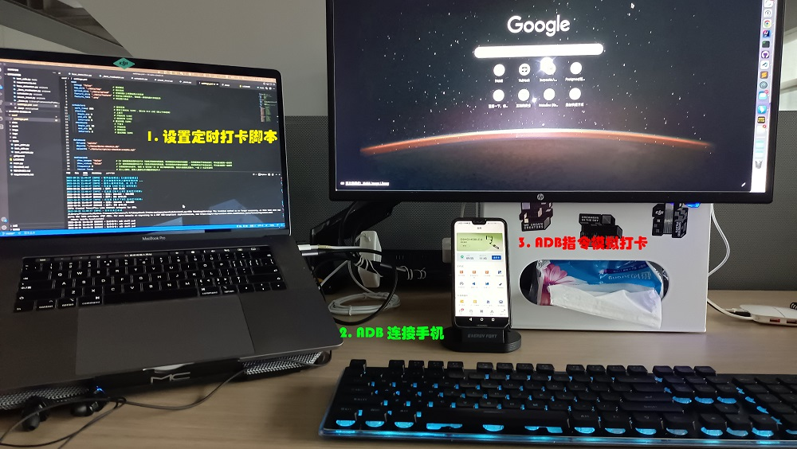
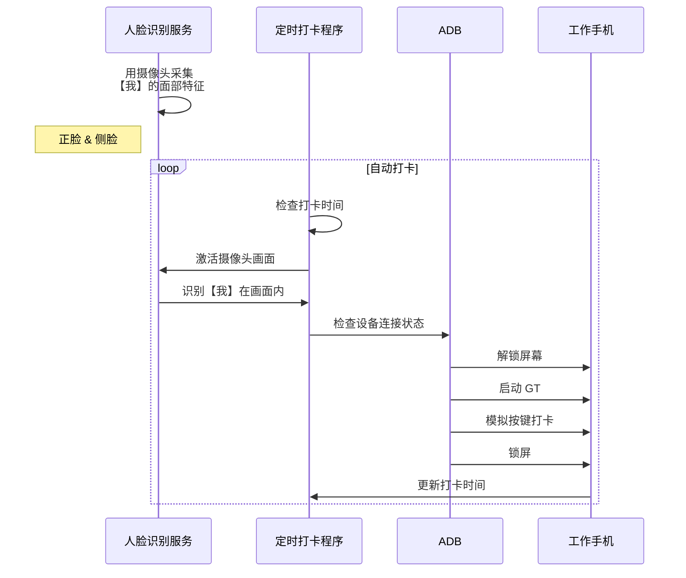

## 0x00 前言

自从搬来天空之城后，因为打卡习惯改变了，导致我上下班经常忘记打卡。

于是我就有了一个构想：能不能在工位做一个打卡机，到点就帮我自动打卡呢？

## 0x10 合法合规

首先这个事情得先确保合法合规，公司目前允许打卡的方式有 2 个：

1. 各楼层门禁
2. 手机 GT （只能在公司范围内）

很自然的就想到只能用手机 GT 来做了，而且因为是在工位打卡，应该是没有问题的。

------

另外早两年做过手机 GT 的渗透，知道 GT 本身也有一些限制条件：

1. 禁止在 ROOT 手机上启动
2. 禁止在模拟器启动
3. 禁止第三方 APP 拉起 GT 服务
4. 必须是本人在摄像头前面才能打卡

所以现在的问题在于，**怎么在前面所有约束条件下，实现自动化打卡呢？**

## 0x20 思路 

### 0x21 版本一

最简单粗暴直接的方法，就是用一个支架把手机立起来，并且打开 GT 签到的界面，然后写一个后台程序定时模拟点击打卡按钮。

但是这个方法不可取，因为 APP 默认是无权限解锁手机屏幕的（起码非 ROOT 环境不行），换言之这个方案成立的必要条件是手机一直亮屏，从安全性考虑就已经不会采纳了。

### 0x22 版本二

由于我的工作手机是 Android 的，所以我在呼吸时就想到借助 [ADB (Android Debug Bridge)](https://developer.android.com/studio/command-line/adb) 工具了。

因此思路转变为：

1. PC 通过 ADB 连接手机
2. PC 设置【上/下班打卡】两个定时任务脚本，脚本触发时：
    - 通过 ADB 指令解除手机的锁屏状态
    - 通过 ADB 指令模拟人工操作，启动 GT 并打卡
    - 通过 ADB 指令通知手机锁屏

硬件接线参考下图：

但是这个方法纯粹只是通过定时任务触发的，若触发时我不在工位上，手机被解锁，依然会有安全风险。

所以这里还欠缺一个关键条件：**必须是【我】在工位上才能解锁手机！**

### 0x23 最终版

由于我不久前才做过一期视觉 AI，手上囤了一些模型，于是我又很自然地在喝水时想到了：利用 PC 的摄像头做人脸识别不就可以了吗？

于是最终整个方案设计演变成这样：

## 0x30 实现原理

录入正脸和侧脸

## 0x?? 成本

> 由于需要 ADB 和长时间待机，手机支架我选用可充电式的

